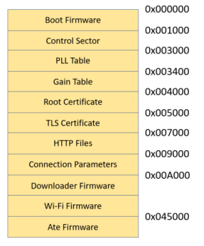

# Introdcution 

ATWINC1500/ATWINC3400 features an on-chip microcontroller and integrated SPI Flash memory for
system firmware. The serial flash memory also stores the root certificate required for TLS/SSL connection and the gain table values used by transceiver. This application note explains in detail downloading procedure of firmware,certificate and gain values into WINC serial flash through different supported serial interfaces like SPI/UART. This document also covers some useful troubleshooting tips for downloading failures.

# Firmware Update project

The ATWINC1500 and ATWINC3400 WiFi devices require firmware to be loaded into flash memory to operate. These devices will come shipped with firmware preloaded, however it may become necessary to update this firmware to take advantage of fixes and new or expanded features.

## Hardware setup 

For the sake of this Applicaiton Note SAMD21 has taken as HostMCU and WINC1500 is used as SPI slave WINC device. The WINC device is attached to EXT1 of the SAM Xplained Pro
kit. Plug a micro USB cable from Windows computer to the debug USB port of the Xplained Pro kit.

## Project Overview

Go to the "src" directory under where the firmware update project located.

A list of batch (.bat) script files in the /src folder of "WINCXXXX_FIRMWARE_UPDATE_PROJECT"
shall be used to trigger a WINC serial flash download.
1. Ensure that the SAM Xplained Pro board is connected to PC via debug USB port. The virtual EDBG
COM port of the board is now listed in the device manager.
2. Run the sam_xplained_pro_firmware_update.bat script that corresponds to connected
Xplained board.
3. These sam_xplained_pro_firmware_update.bat scripts will take of the following jobs:
    * Program Serial Bridge application 
    * Prepare compound programmable binary image
    * Program the prepared binary image in to WINC device.

The script will print the following message in the successfull case.

# Serial Bridge Applicaiton 

As the WINC device is connected to host MCU through SPI interface, upgrading the WINC serial flash via the host MCU would be an easier solution. Since, WINC provides transparent access to host MCU, the WINC serial flash can be read/written from host MCU. The host MCU can program the serial (SPI) flash without need for operational firmware in the WINC. The host MCU running the serial bridge firmware is connected between computer and WINC SPI to dwonload the firmware to WINC serial flash.

winc_programmer_UART <----> samd21_xplained_pro_serial_bridge.elf <----> WINC device

## Serial Flash Download Using SAM Xplained Pro Board

/src/firmware/Tools/serial_bridge shall contain the serial bridge binary images for few of SAM based host MCU’s. This serial bridge firmware uses UART interface available on SAM Xplained Pro boards. The batch script files available in /src folder contains the scripts to program the platform specific serial bridge binary image on the host MCU before it starts the WINC serial flash download. EDBG on SAM Xplained Pro board is used for programming serial bridge image. The script uses the Atmel Studio atprogram.exe commands for programming the host MCU via EDBG of SAM Xplained Pro boards.

A list of batch (.bat) script files in the /src folder of "WINCXXXX_FIRMWARE_UPDATE_PROJECT"
shall be used to trigger a WINC serial flash download.
1. Ensure that the SAM Xplained Pro board is connected to PC via debug USB port. The virtual EDBG
COM port of the board is now listed in the device manager.
2. Run the sam_xplained_pro_firmware_update.bat script that corresponds to connected
Xplained board.

The batch script will program a serial bridge binary on the host MCU to redirect firmware data from the computer (EDBG virtual COM port) to the WINC chip (via SPI). The serial bridge application also performs the WINC power up sequence, thus ensuring that the WINC bootloader is in the appropriate state to start a download.

The binary elf files which are available in the /src/firmware/Tools/serial_bridge directory are taken from the Serial bridge application which are available in ASF and MPAB Harmony.

For ASF, Serial Bridge applicaition can be imported in the same way how firmwae update project was imported. Once imported user can build and flash the serial bridge applciaiton to the device.

For MPLAB Harmony, Serial bridge applicaiton can be found in the wireless/apps/ path inside harmony repository.

With these two project user can build the serial bridge binaries and add it in to the /src/firmware/Tools/serial_bridge inside serial bridge application.

## Serial Flash Download Using Custom Host MCU

The serial bridge example application which is available in ASF and MPLAB Harmony for any SAM based host MCU’s can be taken as base for implementing serial bridge for custom specific host MCU’s.

download_all.bat shall be located in the src/firmware folder of the
“WINCXXXX_FIRMWARE_UPDATE_PROJECT” triggers the serial flash download.
1. Program the host MCU with the custom implemented serial bridge firmware.
2. Ensure that WINC device connected to host MCU is powered up and that the host UART is
connected to PC.
3. In a Windows shell, run the command download_all.bat UART to start the download.
4. During the download process, the batch script will output the firmware version being programmed onto the WINC as well as the previously installed firmware version.

# General information on formware update

This firmware update script sam_xplained_pro_firmware_update.bat internally calls the following scripts.

- download_all_sb 
    - Erase the HostMCU
    - Program the Serial bridge applicaiton 
    - Reset the HostMCU
    - Find COM port where the device is connected
    - Calls download_all batch file

- download_all
    - calls update_pll_table to prepare the image
    - Program the WINC device using winc_programmer_uart.exe utility

- update_pll_table
    - Calculating PLL lookup table using the xo offset from efuse at flash time. 
    - Prepare compound binary image using image_tool utility

An additional script called "prepare_image" binary is available inside "src\firmware" directory which can be used for the following:
* Prepare programmable image along with gain table using image_tool utility
* Prepare OTA image along with gain table using image_tool utility

prepare_image and update_pll_table both does the same job which preparing compound image but there are few difference as mentioned below.

| prepare_image | update_pll |
| ----------- | ----------- |
| Does not update PLL table based on xo offset | Updates PLL lookup table using the xo offset from efuse at flash time. |
| prepares OTA image | Does not prepare prepares OTA image |
| includes Gain table to create binary image | Does not includes Gain table to create binary image |
| Not for production line | Created for production level purpose |

### To summerize the above points 

- User can prepare binary image and program the WINC by using alone any of the firmeare update script file available in the src directory insdie firmware update project.
For example, if the Host MCU is SAMD21 user can run the samd21_xplained_pro_firmware_update script file.

- To build the image alone user can either use update_pll script or image_tool based on his requirement.

## Building the binary firmware image

WINC1500 memory is divided in to following sections:

The image_tool collects all the firmware for each section and combine it in to one firmware called m2m_image_3a0.bin
The Image_tool gathers the above-mentioned section and its address information from flash_image XML file. Please refer flash_image XML file for more information on how memory is divided.

image_tool and the configuration XML file both can be found under "src\firmware" directory inside firmware_update_project.

| usage | command |
| ----------- | ----------- |
| To create compound image | image_tool.exe -c flash_image.config -o firmware\m2m_image_3a0.bin -of prog |
| Writing to a specified region(Root certificate) | image_tool.exe -c flash_image.config -o firmware\m2m_image_3a0.bin -of prog -r "root certificates" |
| To create OTA compound image | image_tool.exe -c flash_image.config -c c Tools\gain_builder\gain_sheets\new_gain.config -o ota_firmware\m2m_ota_3A0.bin -of winc_ota -s ota |

| argumenats | explanation |
| ----------- | ----------- |
| -c | stands for configuration files. Microchip recommends to use the default configuration files which is flash_image.config  |
| -o | output name of the binary image files. For WINC1500 it should be m2m_image_3a0.bin and for WINC3400 it should be m2m_image_3400.bin |
| -of | stands for output format. The image_tool supports 4 output formats 1. raw         - A raw binary image. 2. winc_ota    - WINC OTA format. 3. prog        - Format suitable for programming. 4. log         - Textual log information.  |
| -r | Specifies a region to process. More than one region can be specified with repeated use of this option. If used only the regions specified will be processed.  |

### For more information, enter image_tool help command:

image_tool -h

## Commands logs

### create compound image	
Command: image_tool.exe -c flash_image.config -o firmware\m2m_image_3a0.bin -of prog

### create compound image	
Command: image_tool.exe -c flash_image.config -o firmware\m2m_image_3a0.bin -of prog -r "root certificates"

### create compound image	
Command: image_tool.exe -c flash_image.config -c c Tools\gain_builder\gain_sheets\new_gain.config -o ota_firmware\m2m_ota_3A0.bin -of winc_ota -s ota

## Programming the binary firmware image

There are two tools  available to program the WINC1500 device.
1.	winc_programmer_UART – Device to program it via UART interface
2.	winc_programmer_I2C - Device to program it via I2C interface

For winc_programmer_UART tool to work as expected, an application called serial_bridge is used in the host SAM device which acts as bridge between the programmer winc_programmer_UART tool and the WINC device.
This serial_bridge applicaiton as the name implies acts a bridge between winc_programmer_UART and WINC1500 device.

Serial bridge applications for the corresponding Host device can be found in the firmware\Tools\serial_bridge path under firmware_update_project

But the user can directly use MPLab serial bridge application to download it into the Host memory.

winc_programmer_UART <----> samd21_xplained_pro_serial_bridge.elf <----> WINC device

Similarly winc_programmer_I2C uses Aardvark tool to communicaite with WINC1500 device. 
Please note this document covers only the winc_programmer_UART tool.

### command to program WINC device using winc_programmer_UART tool:

| usage | command |
| ----------- | ----------- |
| Erase WINC1500 memory | winc_programmer_UART.exe  -p \\.\COM16 -d winc1500 -e -pfw programmer_firmware\release3A0\programmer_release_text.bin |
| Write the created binary image to WINC1500 memory | winc_programmer_UART.exe  -p \\.\COM16 -d winc1500 -i m2m_image_3A0.bin -if prog -w -pfw programmer_firmware\release3A0\programmer_release_text.bin |
| Read back the written image from WINC1500 memory | winc_programmer_UART.exe  -p \\.\COM16 -d winc1500 -r -pfw programmer_firmware\release3A0\programmer_release_text.bin |
| Verify the written data with binary binary image | winc_programmer_uart.exe  -p \\.\COM16 -d winc1500 -i m2m_image_3A0.bin -if prog -r -pfw ..\programmer_firmware\release3A0\programmer_release_text.bin  |
| Single command to read write and verify | winc_programmer_UART.exe  -p \\.\COM16 -d winc1500 -e -i m2m_image_3A0.bin -if prog -w -r -pfw programmer_firmware\release3A0\programmer_release_text.bin |

| argumenats | explanation |
| ----------- | ----------- |
| -p | is the port number which can be found by entering the command: test_edbg |
| -d | stands for WINC device it can be WINC1500 or WINC3400 |
| -e | To erase the WINC device memory before wirting the firmware image  |
| -w | To write the firmware image  |
| -r | To read the firmware image  |
| -if | Input format.          winc_ota    - WINC OTA format. raw         - A raw binary image. prog        - Format suitable for programming.  |
| -pfw | programming firmware    WINC firmware used to program the device.  |

### For more information enter image_tool help command:

winc_programmer_UART.exe -h

## Commands logs
### Erase compound image	
Command: winc_programmer_UART.exe -p \.\COM16 -d winc1500 -e -pfw programmer_firmware\release3A0\programmer_release_text.bin

### write compound image	
command: winc_programmer_UART.exe -p \.\COM16 -d winc1500 -i m2m_image_3A0.bin -if prog -w -pfw programmer_firmware\release3A0\programmer_release_text.bin

### Read compound image	
Command: winc_programmer_UART.exe -p \.\COM16 -d winc1500 -r -pfw programmer_firmware\release3A0\programmer_release_text.bin

### Verify compound image	
command: winc_programmer_uart.exe -p \.\COM16 -d winc1500 -i m2m_image_3A0.bin -if prog -r -pfw ..\programmer_firmware\release3A0\programmer_release_text.bin

### reade write verify compound image	
command: winc_programmer_UART.exe -p \.\COM16 -d winc1500 -e -i m2m_image_3A0.bin -if prog -w -r -pfw programmer_firmware\release3A0\programmer_release_text.bin

