### Table of contents
{: .no_toc .text-delta }

1. TOC
{:toc}

# Introdcution 

ATWINC1500/ATWINC3400 features an on-chip microcontroller and integrated SPI Flash memory for system firmware. The serial flash memory also stores the root certificate required for TLS/SSL connection and the gain table values used by transceiver. This application note explains in detail downloading procedure of firmware,certificate and gain values into WINC serial flash through different supported serial interfaces like SPI/UART. This document also covers some useful troubleshooting tips for downloading failures.

# Firmware update project

The ATWINC1500 and ATWINC3400 WiFi devices require firmware to be loaded into flash memorY. The ATWINC1500 and ATWINC3400 devices are preloaded with the firmware, however IT would be useful to update the latest firmware to take advantage of fixes and new features.

## Hardware setup 

* SAM D21 Xplained Pro Evaluation Kit (SAMD21 is used as a HostMCU).
* ATWINC1500/ATWINC3400 - Wi-Fi SPI slave device connected to SAMD21 HostMCU device.
* The WINC device is attached to EXT1 of the SAMD21 Xplained Pro kit. 
* Plug a micro USB cable from Windows computer to the debug USB port of the SAMD21 Xplained Pro kit.

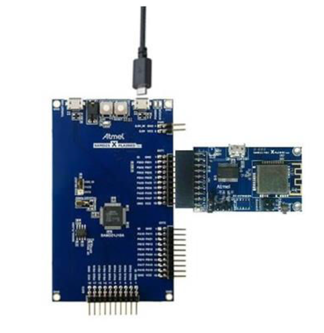

## Project Overview

The "src" folder inside "WINCXXXX_FIRMWARE_UPDATE_PROJECT" contains a list of batch (.bat) script files which are used to trigger a WINC serial flash download.
* Ensure that the SAM Xplained Pro board is connected to PC via debug USB port. 
* The virtual EDBG COM port of the board is now listed in the device manager.
* Run the sam_xplained_pro_firmware_update.bat script that corresponds to connected
Xplained board.
* These sam_xplained_pro_firmware_update.bat scripts will take care of the following jobs:
    * Program Serial Bridge application 
    * Prepare compound programmable binary image
    * Program the prepared binary image in to WINC device.

The script will print the following message in the successful case.

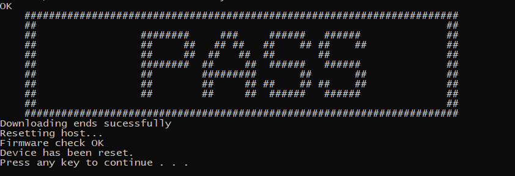

# Serial Bridge Applicaiton 

As the WINC device is connected to host MCU through SPI interface, upgrading the WINC serial flash via the host MCU would be an easier solution. Since, WINC provides transparent access to host MCU, the WINC serial flash can be read/written from host MCU. The host MCU can program the serial (SPI) flash without the need for operational firmware in the WINC. The host MCU running the serial bridge firmware is connected between computer and WINC SPI to dwonload the firmware to WINC serial flash.

winc_programmer_UART (PC) <----> samd21_xplained_pro_serial_bridge.elf <----> WINC SPI device

## Serial Flash Download Using SAM Xplained Pro Board

/src/firmware/Tools/serial_bridge shall contain the serial bridge binary images for few of SAM based host MCU’s. This serial bridge firmware uses UART interface available on SAM Xplained Pro boards. The batch script files available in the firmware update project /src folder contains the scripts to program the platform specific to serial bridge binary image on the host MCU before it starts the WINC serial flash download. EDBG on SAM Xplained Pro board is used for programming serial bridge image. The script uses the Atmel Studio atprogram.exe commands for programming the host MCU via EDBG of SAM Xplained Pro boards.

The same batch (.bat) script files in "src" folder inside "WINCXXXX_FIRMWARE_UPDATE_PROJECT" will trigger the WINC serial flash download.
* Ensure that the SAM Xplained Pro board is connected to PC via debug USB port. 
* The virtual EDBG COM port of the board is now listed in the device manager.
* Run the sam_xplained_pro_firmware_update.bat script that corresponds to connected
Xplained board.


A list of batch (.bat) script files in the /src folder of "WINCXXXX_FIRMWARE_UPDATE_PROJECT"
shall be used to trigger a WINC serial flash download.
1. Ensure that the SAM Xplained Pro board is connected to PC via debug USB port. The virtual EDBG
COM port of the board is now listed in the device manager.
2. Run the sam_xplained_pro_firmware_update.bat script that corresponds to connected
Xplained board.

The batch script will program a serial bridge binary on the host MCU to redirect firmware data from the computer (EDBG virtual COM port) to the WINC chip (via SPI). The serial bridge application also performs the WINC power up sequence, thus ensuring that the WINC bootloader is in the appropriate state to start a download.


The binary elf files which are available in the /src/firmware/Tools/serial_bridge directory are taken from the Serial bridge application which are available in ASF and MPAB Harmony.

For ASF, Serial Bridge applicaition can be imported in the same way how firmware update project is imported. Once imported user can build and copy the built elf file to the /src/firmware/Tools/serial_bridge path inside "WINCXXXX_FIRMWARE_UPDATE_PROJECT" directory.

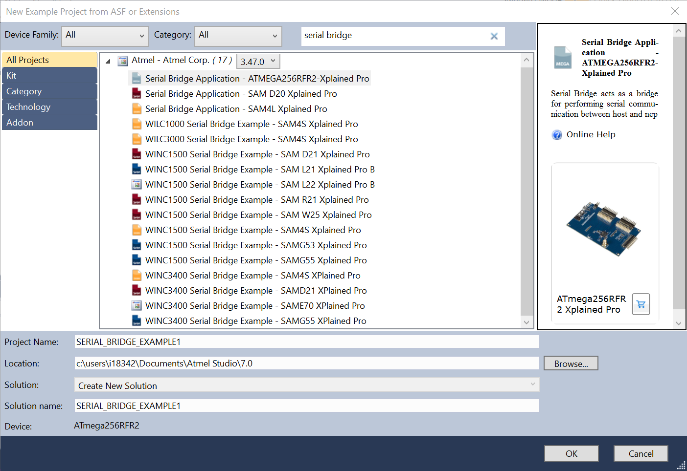

For MPLAB Harmony, Serial bridge applicaiton can be found in the wireless/apps/ path inside harmony repository. User can open the project in the MPLABX IDE, build it and copy the elf file to the /src/firmware/Tools/serial_bridge path inside "WINCXXXX_FIRMWARE_UPDATE_PROJECT" directory.

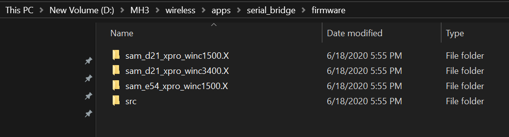

With these two project user can build the serial bridge binaries and add it in to the /src/firmware/Tools/serial_bridge inside serial bridge application.

## Serial Flash Download via Built-in UART

The serial flash download can be done using the built-in UART of ATWINC1500 device. Prior to running any update script, ensure that the hardware is setup as required. Note: ATWINC3400 does not support download through built-in UART at present.

### Hardware Setup

#### Power On Sequence
To perform a serial flash download using the ATWINC1500 built-in UART, it is mandatory that the ATWINC1500 chip is in the right bootloader state. To do so, the HostMCU must power up the ATWINC1500 chip and then perform the reset sequence as defined in the datasheet. This can be done very easily from the HostMCU by calling the m2m_bsp_init() function.

```
int main(void)
{
/* Initialize the board. */
system_init();
/* Initialize the BSP. */
nm_bsp_init();
while(1) {
}
}
```

#### UART Pin assignment

Pin assignment of WINC1500 module UART are described in the following table. On ATWINC1500 Xplained Pro, TX and RX are available on through holes labeled “DEBUG_UART” for easy identification.

| ATWINC1500 module pin name | ATWINC1500 Xplained Pro pin name | Function |
| ----------- | ----------- | -------------- |
| J14 | UART_TX | TXD |
| J19 | UART_RXD | RXD |

download_all.bat batch script shall be located in the src/firmware folder of the
"WINCXXXX_FIRMWARE_UPDATE_PROJECT" triggers the download through built-in UART.

Ensure that the HostMCU is powered up and that the ATWINC1500 built-in UART is connected to PC via a
serial to USB converter.
2. In a Windows shell, run the command download_all.bat UART to start the download.
Note: The gain setting values for SAMW25 module is different than the gain setting values of
ATWINC1500 module. The above command downloads ATWINC1500 module gain values. The
command for SAMW25 to incorporate the gain values of SAMW25 module:
download_all.bat UART SAMW25
3. During the download process, the batch script will output the firmware version being programmed
onto the ATWINC1500 as well as the previously installed firmware version.

## Serial Flash Download Using Custom HostMCU

The serial bridge example application which is available in ASF and MPLAB Harmony for any SAM based HostMCU’s can be taken as base for implementing serial bridge for custom specific HostMCU’s.

download_all_sb.bat shall be located in the src/firmware folder of the
“WINCXXXX_FIRMWARE_UPDATE_PROJECT” triggers the serial flash download.
1. Mofify the script to program the HostMCU with the custom implemented serial bridge firmware.
2. Ensure that ATWINC1500 device connected to HostMCU is powered up and that the host UART is
connected to PC.

# General information on firmware update

This firmware update script sam_xplained_pro_firmware_update.bat internally calls the following scripts.

- download_all_sb 
    - Erase the HostMCU
    - Program the Serial bridge application 
    - Reset the HostMCU
    - Find COM port where the device is connected
    - Calls download_all batch file

- download_all
    - calls update_pll_table to prepare the image
    - Program the ATWINC1500 device using winc_programmer_uart.exe utility

- update_pll_table
    - Calculating PLL lookup table using the xo offset from efuse at flash time. 
    - Prepare compound binary image using image_tool utility

An additional script called "prepare_image" binary is available inside "src\firmware" directory which can be used for the following:
* Prepare programmable image along with gain table using image_tool utility
* Prepare OTA image along with gain table using image_tool utility


prepare_image and update_pll_table both does the same job which preparing compound image but there are few difference as mentioned below.

| prepare_image | update_pll |
| ----------- | ----------- |
| Does not update PLL table based on xo offset | Updates PLL lookup table using the xo offset from efuse at flash time. |
| prepares OTA image | Does not prepare prepares OTA image |
| includes Gain table to create binary image | Does not includes Gain table to create binary image |
| Not for production line | Created for production level purpose |


## ATWINC1500 Binary tools

The above mentioned script files internally use the following tools to build and program the image.
1. image_tool - Builds firmware binary image
2. winc_programmer_uart – Program the built firmware binary image to the WILC device.

## Building Firmware Image

image_tool is located in src/firmware is used to build binary images for ATWINC devices. It collects all the firmware for each section and combine it in to one firmware called m2m_image_XXXX.bin. The Image_tool gathers the above-mentioned section and its address information from flash_image XML file. Please refer flash_image XML file for more information on how memory is divided.

ATWINC1500 memory segmentation:

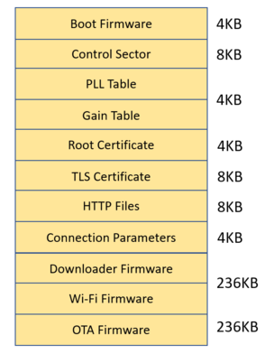

ATWINC3400 memory segmentation:

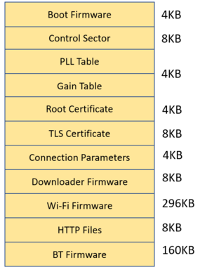


image_tool and the configuration XML file both can be found under "src\firmware" directory inside firmware_update_project.

### image_tool usage

| usage | command |
| ----------- | ----------- |
| To create firmware image | image_tool.exe -c flash_image.config -o firmware\m2m_image_3a0.bin -of prog |
| Writing to a specific region(Root certificate) | image_tool.exe -c flash_image.config -o firmware\m2m_image_3a0.bin -of prog -r "root certificates" |
| To create OTA firmware image | image_tool.exe -c flash_image.config -c c Tools\gain_builder\gain_sheets\new_gain.config -o ota_firmware\m2m_ota_3A0.bin -of winc_ota -s ota |

| argumenats | explanation |
| ----------- | ----------- |
| -c | stands for configuration files. Microchip recommends to use the default configuration files which is flash_image.config  |
| -o | output name of the binary image files. For ATWINC1500 it should be m2m_image_3a0.bin and for ATWINC3400 it should be m2m_image_3400.bin |
| -of | stands for output format. The image_tool supports 4 output formats 1. raw         - A raw binary image. 2. winc_ota    - WINC OTA format. 3. prog        - Format suitable for programming. 4. log         - Textual log information.  |
| -r | Specifies a region to process. More than one region can be specified with repeated use of this option. If used only the regions specified will be processed.  |

For more information, enter image_tool help command:

image_tool -h

### Commands logs

#### Creating Firmware image	
Expected output log for the command: image_tool.exe -c flash_image.config -o firmware\m2m_image_3a0.bin -of prog


#### Writing to a specific region
Expected output log for the command: image_tool.exe -c flash_image.config -o firmware\m2m_image_3a0.bin -of prog -r "root certificates"

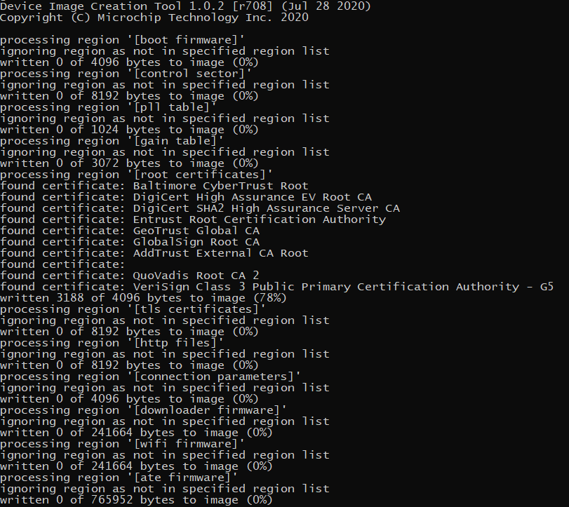
#### Creating OTA Firmware image	
Expected output log for the command: image_tool.exe -c flash_image.config -c c Tools\gain_builder\gain_sheets\new_gain.config -o ota_firmware\m2m_ota_3A0.bin -of winc_ota -s ota

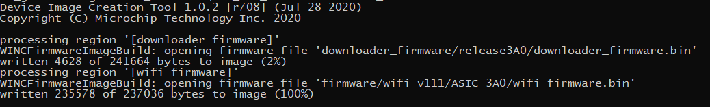


## Programming Firmware Image

winc_programmer_uart tool located in src/firmware is used to program the binary images for WINC devices. it does the following primary jobs:
* Erase the ATWINC memory
* Read the firmware from ATWINC 
* Write the firmware to ATWINC
* Verify the written firmware.


### winc_programmer_uart tool usage

| usage | command |
| ----------- | ----------- |
| Erase ATWINC memory | winc_programmer_UART.exe  -p \\.\COM16 -d winc1500 -e -pfw programmer_firmware\release3A0\programmer_release_text.bin |
| Write the created binary image to ATWINC memory | winc_programmer_UART.exe  -p \\.\COM16 -d winc1500 -i m2m_image_3A0.bin -if prog -w -pfw programmer_firmware\release3A0\programmer_release_text.bin |
| Read back the written image from ATWINC memory | winc_programmer_UART.exe  -p \\.\COM16 -d winc1500 -r -pfw programmer_firmware\release3A0\programmer_release_text.bin |
| Verify the written image in ATWINC device | winc_programmer_uart.exe  -p \\.\COM16 -d winc1500 -i m2m_image_3A0.bin -if prog -r -pfw ..\programmer_firmware\release3A0\programmer_release_text.bin  |
| Single command which does all the above operations | winc_programmer_UART.exe  -p \\.\COM16 -d winc1500 -e -i m2m_image_3A0.bin -if prog -w -r -pfw programmer_firmware\release3A0\programmer_release_text.bin |

| argumenats | explanation |
| ----------- | ----------- |
| -p | is the port number which can be found by entering the command: test_edbg |
| -d | stands for ATWINC device it can be ATWINC1500 or ATWINC3400 |
| -e | To erase the ATWINC device memory before wirting the firmware image  |
| -w | To write the firmware image  |
| -r | To read the firmware image  |
| -if | Input format.          winc_ota    - WINC OTA format. raw         - A raw binary image. prog        - Format suitable for programming.  |
| -pfw | programming firmware    WINC firmware used to program the device.  |

For more information enter winc_programmer_uart help command:

winc_programmer_UART.exe -h

### Commands logs
#### Erase WINC memory	
Command: winc_programmer_UART.exe -p \.\COM16 -d winc1500 -e -pfw programmer_firmware\release3A0\programmer_release_text.bin


#### Write Firmware image to WINC
Expected output log for the command: winc_programmer_UART.exe -p \.\COM16 -d winc1500 -i m2m_image_3A0.bin -if prog -w -pfw programmer_firmware\release3A0\programmer_release_text.bin

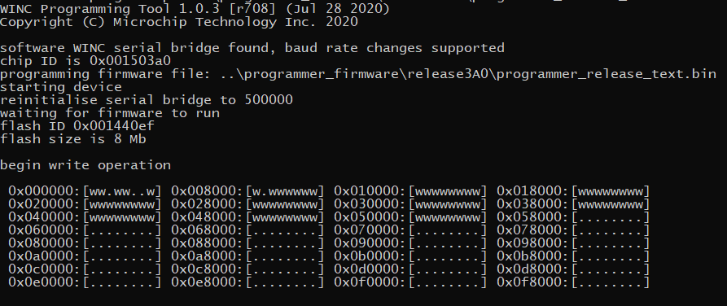
#### Read firmware image from WINC memory	
Expected output log for the Command: winc_programmer_UART.exe -p \.\COM16 -d winc1500 -r -pfw programmer_firmware\release3A0\programmer_release_text.bin

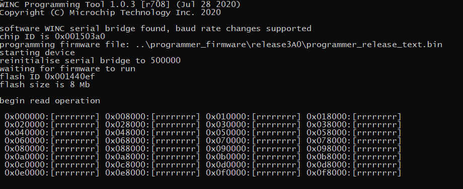
#### Verify the written image	
Expected output log for the command: winc_programmer_uart.exe -p \.\COM16 -d winc1500 -i m2m_image_3A0.bin -if prog -r -pfw ..\programmer_firmware\release3A0\programmer_release_text.bin

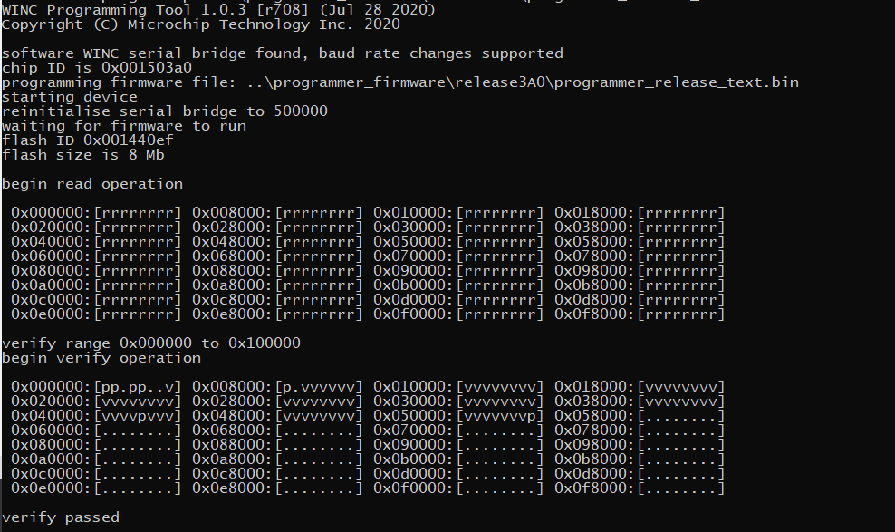
#### Single command which does all the above operations	
Expected output log for the command: winc_programmer_UART.exe -p \.\COM16 -d winc1500 -e -i m2m_image_3A0.bin -if prog -w -r -pfw programmer_firmware\release3A0\programmer_release_text.bin

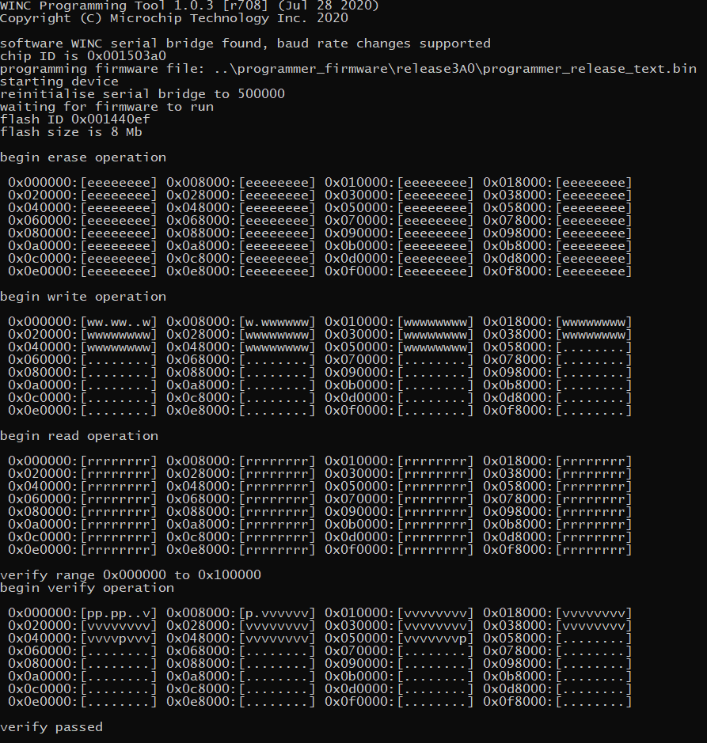


# Download Failure Troubleshooting
Here are the troubleshooting tips for a specific error while downloading using batch script.

## Failed To Find Any COM Port

The winc_programmer_UART.exe expects a COM port as an argument. If the expected COM port is not found then it wil throw error.


How to fix it:
* Make sure ATWINC COM port is listed in the device manager.
* Make sure ATWINC COM port is not opened by any other application. For verification, try to open and close the COM port with a terminal application.
* Cheap USB cable (serial bridge) or cheap serial to USB converter (built-in UART) can introduce garbage on the UART line thus failing the detection of the ATWINC COM port. Try a different cable.
* When performing a built-in UART download, it is expected that the ATWINC bootloader is in a particular state that can only be achieved after doing a clean power up and reset sequence. Hence, before doing a download always ensure that a clean power up and reset sequence has been made.
* Make sure that no other extension board (ex: IO1...) is connected to the Xplained Pro board while performing the download.
* Make sure the project path is not exceeding Windows maximum 260 characters path length


## Found More Than One Matching Tool

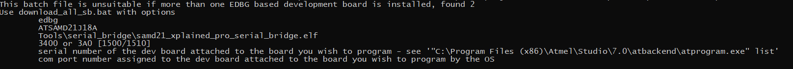

The Found more than one matching tool error could be observed when downloading using
Xplained Pro board serial bridge with sam_xplained_pro_firmware_update.bat batch script. The script will try to look for available COM ports and try to match each COM port name with “EDBG” string. This is to program the serial bridge binary image on the HostMCU.
How to fix it:
* All the Xplained Pro boards are enumerated with “EDBG Virtual COM Port”. Make sure to connect one Xplained Pro board at a time on PC.

## Listing More Than One COM Port

More than one COM port could be listed when downloading using download_all.bat where the
HostMCU already has the serial bridge firmware or download through built-in UART. The winc_programmer_UART tool used to perform a serial bridge or a built-in UART download will try to look for available COM ports and try to match each COM port name with “EDBG” string or a port number “COM” string. If one of the two conditions is true, the program will then try to send a 0x12 char on each UART line. The other side is then expected to answer 0x5A for a built-in UART update or 0x5B for a serial bridge update.
If the expected response is received on all UART lines, the script will list all the detected COM ports.

How to fix it:
* Input COM port number of the intended device to be downloaded when Please enter COM
port number to program: is displayed as shown in the above figures.
* Note that for each downloading option of ATWINC chip firmware, TLS/SSL root certificates, gain table the COM port number to be given. To avoid this, it is possible to force the winc_programmer_UART tool to use a specific COM port number in the beginning. For example to use COM56, run the script like this: download_all.bat UART 56


## Failed To Initialize Programmer: Invalid Chip ID

The Failed to initialize programmer with Invalid chip ID error typically happens when
there is garbage or noise on the UART line preventing from reading the correct chip ID value.
How to fix it:
* Try connecting the PC and the ATWINC with a different cable. A clean power up and reset sequence of the ATWINC is necessary to start over with the ATWINC bootloader in the appropriate state.

## Failed To Initialize Programmer: Waiting For Chip Permission

After printing the correct chip ID of the ATWINC, the winc_programmer_UART tool programs a small binary (programmer firmware) to assist with ATWINC flash programming. At this stage the winc_programmer_UART will change the UART baud rate from 115200 to 500000 to speed up the actual transfer of the firmware image. Once the baud rate change is made, the chip permission is verified to ensure the UART connection is reliable. Failing at this stage means that the current setup does not support such a high baud rate.
How to fix it:
* It is recommended to try connecting the PC and the ATWINC with a different cable. Also a clean power up and reset sequence of the ATWINC is necessary to start over with the ATWINC bootloader in the appropriate state.