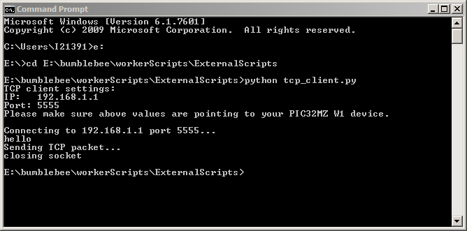

# TCP Server 

This example application acts as a TCP Server to which a TCP Client can connect and exchange data in a non-blocking manner.

## Description

This example shows the read and write operation over a TCP Connection in a non-blocking manner. The DUT shall act as a Soft AP and the Station running the TCP Client shall connect to this Soft AP and establish connection with the TCP Server running on the DUT.

## Downloading and building the application

To download or clone this application from Github, go to the [top level of the repository](https://github.com/Microchip-MPLAB-Harmony/wireless)

Path of the application within the repository is **apps/tcp_server/firmware** .

To build the application, refer to the following table and open the project using its IDE.

| Project Name      | Description                                    |
| ----------------- | ---------------------------------------------- |
| pic32mz_w1_curiosity_freertos.X | MPLABX project for PIC32MZ W1 Curiosity Board |
|||

## Setting up PIC32MZ W1 Curiosity Board

- Connect the Debug USB port on the board to the computer using a micro USB cable
- On the GPIO Header (J207), connect U1RX (PIN 13) and U1TX (PIN 23) to TX and RX pin of any USB to UART converter
- Laptop/ Mobile (to run the TCP Client on it)

## Running the Application

1. Open the project and launch Harmony3 configurator.

2.	Currently Net Service is configured to run as TCP Server running on port 5555. In case the user wants to change this config, please make the changes in the Net Service Module as shown below:

3. Currently Net Service is configured to run a TCP Client in Secured mode to connect to www.google.com on the https port (443). In case the user wants to change this config, please make the changes in the Net Service Module configurations as shown below:

4.	Save configurations and generate code via MHC 
5.	Build and program the generated code into the hardware using its IDE
6. Open the Terminal application (Ex.:Tera term) on the computer
7. Connect to the "USB to UART" COM port and configure the serial settings as follows:
    - Baud : 115200
    - Data : 8 Bits
    - Parity : None
    - Stop : 1 Bit
    - Flow Control : None

8.	The device shall come up as SoftAP and then as per the default Net Service configuration, the TCP Server shall come up, awaiting a connection from a TCP Client.

9.	Connect a Laptop tp the Soft AP (with SSID DEMO_AP_SOFTAP) running on the DUT
10. Start a TCP Client (python script) on laptop, giving the server IP as the IP of the Board, and the port as 5555:

Note: The secured tcp connection may require the user to modify WolfSSL component settings in MHC depending on the security settings of the site/ server he is trying to access.